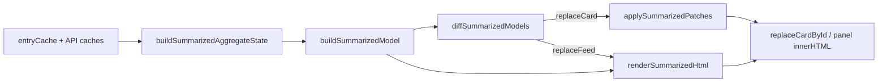

# Operator logs UI (`embedui/logs/`)

Route: `/ui/logs` — shell HTML: `embedui/logs.html`.

**Operator entry (canonical):** use `/ui/logs` in the browser or `/ui/desktop` in the desktop shell (settings opens embedded logs). Legacy `/ui/panel` and `/ui/metrics` redirect here with `?focus=admin` or `?focus=metrics`.

## URL → disk map

| Served URL | Embed path | Role |
|------------|------------|------|
| `/ui/assets/logs.js` | `embedui/logs_entry.js` | Entry: calls `ChimeraLogs.Main()` after modules load |
| `/ui/assets/logs/main.js` | `embedui/logs_app.js` | App boot, state, transport ctx, module mount |
| `/ui/assets/logs/contracts.js` | `embedui/logs/contracts.js` | Generated from `internal/naming` (`make operator-contracts-generate`) |
| `/ui/assets/logs/**` | `embedui/logs/**` | Pure derive, components, `app/`, `render/` |

## Script load order

See the comment block in `logs.html`. Do not reorder without checking dependencies:

1. `testing/loader.js`, `contracts.js`
2. `util/*`, `parse/*`, `transport/streaming.js`
3. `derive/*` (broker, vectorstore, gateway, indexer, conversation)
4. `components/*`, `render/sumEvlog.js`
5. `summarized/hash.js`, `summarized/model.js`, `summarized/renderHtml.js`, `summarized/patch.js`, `app/summarizedDirtyRouting.js`, `app/summarizedFeed.js`, `app/wireHandlers.js`
6. `main.js` (`logs_app.js`), `logs.js` (`logs_entry.js`)

## HTTP APIs (operator)

JSON request/response shapes are defined in Go as [`internal/operatorapi`](../../../../../../../internal/operatorapi/) (repo root). Handlers under `adminui/api/*` encode those DTOs; field names are the wire contract.

| Endpoint | Use |
|----------|-----|
| `GET /api/ui/logs` | Initial tail + backfill (`seq`, `source`, `text`, `ts`) |
| `GET /api/ui/logs/stream` | SSE live lines |
| `GET /api/ui/metrics` | Gateway usage card (SQLite rollup) — `operatorapi.MetricsResponse` |
| `GET /api/ui/state` | Gateway overview + admin YAML — `operatorapi.StateResponse` |
| `GET /api/ui/tokens` | Token labels for conversation titles — `operatorapi.TokensListResponse` |
| `GET /api/ui/chimera-broker/providers` | Broker provider health strip — `operatorapi.ProviderHealthResponse` |

## View modes

Summarized-only in current builds (`viewMode === "summarized"`). Panel: `#panel-summarized` (`data-testid="panel-summarized"`).

| Concern | Owner module |
|---------|----------------|
| SSE / tail / backfill | `transport/streaming.js` |
| Summarized feed rebuild | `app/summarizedFeed.js` |
| Event-log rows in cards | `render/sumEvlog.js` |
| DOM clicks / admin forms | `app/wireHandlers.js` |
| Card metrics (pure) | `derive/*` |

### Summarized panel rebuild and interaction

`refreshSummarizedPanel()` builds the view model, diffs against `ctx.lastSummarizedModel`, and applies `replaceCard` patches when structure is unchanged; otherwise it replaces `#panel-summarized` via `innerHTML`. Then it restores open `
` ids, panel scroll, and some nested scroll positions. It does **not** restore focus or in-progress form values unless guarded.

**Deferred rebuild** (`summarizedPanelInteractionBlocksRebuild` in `summarizedFeed.js`): while true, `refreshSummarizedPanel` schedules `scheduleDeferredSummarizedRefresh` (300ms retry) instead of rebuilding. Rebuild is deferred when:

- `Date.now() < ctx.sumEvlogPointerSuppressedUntil` (480ms after pointerdown on an evlog row or a `details.sum-card > summary` inside `#panel-summarized`)
- Focus is inside `#panel-summarized` on an `input`, `textarea`, or `select`
- Focus is on evlog search/filter controls or admin routing/fallback/router YAML fields (legacy ids)

**Drafts** (`ctx` in `logs_app.js`, wired in `wireHandlers.js`, rendered in card modules): survive rebuild when deferral is not enough (e.g. poll returns new metrics while the field still has focus). Provider admin uses `adminProviderKeyDraft` (groq/gemini) and `adminOllamaUrlDraft`; routing uses `routingPolicyDraft`; new users use `adminUserDrafts`.

**Poll-path card patches** (`patchAdminCardsFromPoll` in `summarizedFeed.js`): the 12s admin poll (`syncAdminStatePolling`) replaces individual cards via `replaceCardById` instead of assigning `#panel-summarized` `innerHTML`. Patched ids: `admin-users`, `admin-provider-{groq,gemini,ollama}`, `admin-routing-rules`, `admin-fallback-chain`, `admin-router-model` (routing trio skipped while their Configure/YAML edit mode is active). Missing cards schedule `scheduleStoryRebuild()` (full rebuild). Gateway metrics/overview use the same helper from their own polls.

**Live-log dirty cards** (Phase 3): `appendLine` in `transport/streaming.js` calls `markSummarizedDirtyFromEntry` + `scheduleSummarizedDirtyFlush` (one `requestAnimationFrame` batch per frame) instead of `scheduleStoryRebuild`. Routing is pure in `app/summarizedDirtyRouting.js` (`ChimeraLogs.Summarized.dirtyTargetsForEntry`). `flushSummarizedDirtyCards` patches conversation, service (`svc-*`), indexer workspace (`ix-*`), and admin-provider cards via `replaceCardById`; falls back to full `refreshSummarizedPanel` when many cards are dirty (≥10 or ≥30% of visible cards) or a patch misses. Historical backfill (`prependHistoricalEntries`) and cache trim still use full rebuild.

**View model** (Phase 4): `buildSummarizedAggregateState()` → `ChimeraLogs.Summarized.Model.buildSummarizedModel(deps, state)` → `ChimeraLogs.Summarized.Render.renderSummarizedHtml(model, renderers)`. Each card is `{ id, kind, section, sortKey, hash, summary, body, source }` (no HTML in the model). `renderSummarizedUnified()` is thin; `ctx.lastSummarizedModel` is kept for dirty-card patches. Per-card `hash` is a stable digest of `summary` + `body` fields (for Phase 5 diff).

**Patch engine** (Phase 5): `ChimeraLogs.Summarized.Patch.diffSummarizedModels(prev, next)` → `replaceCard` ops when structure matches and `hash` changed; `replaceFeed` when card order/ids, section breaks, or `meta.hasThreads` change. `applySummarizedPatches` applies ops via `replaceCardById` (sets `data-card-hash` on roots). `refreshSummarizedPanel()` tries patch first (skips when ≥10 or ≥30% cards dirty); `forceSummarizedFullRebuild(reason)` and `scheduleStoryRebuild()` bypass patch for structural events. Admin cards in edit mode are skipped via `summarizedPatchSkipCardIds()`.

See [`docs/plans/logs-ui-page-data-refreshing.md`](../../../../../../../../docs/plans/logs-ui-page-data-refreshing.md) for the phased plan (patch engine).

## If you change X, also check Y

- `timeline_kind` slugs in Go → edit `internal/naming/gateway_logs.go` / `logs_ui.go`, run `make operator-contracts-generate`, then check `derive/gatewayCardModel.js` / conversation join
- New derive export → `adminui/embed/embedui_test/logs_components_test.go` goja fixture
- Embed path → `adminui/ui_handlers.go` `//go:embed` and mux routes
- Service badge CSS → `logs.css` + `contracts.serviceBadgeClass` / summarized badge builders
