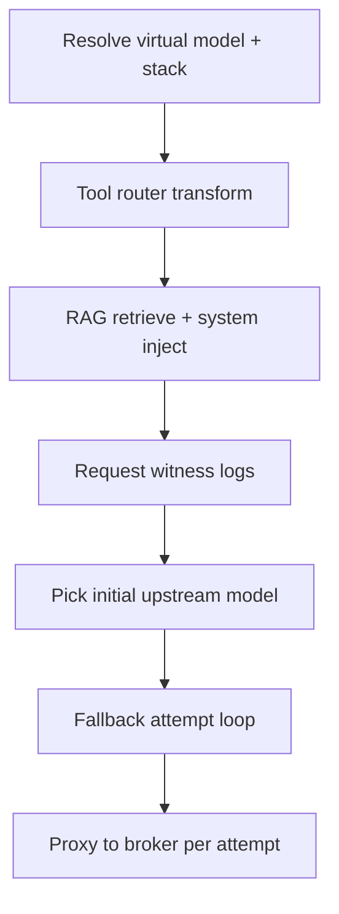

# Feature: Gateway chat routing pipeline

| Field | Value |
|-------|-------|
| **Doc kind** | `platform-contract` |
| **Areas** | Gateway chat path, routing, transforms, RAG, fallback, tool router |
| **Status** | `current` (pipeline shipped; **formal router plugin API** not yet) |
| **Introduced** | v0.1 routing + v0.1.1 tool router; virtual-model stacks v0.2+ |
| **Originated from** | [`plans/virtual-models-operator.md`](../plans/virtual-models-operator.md), [`plans/context-window-admission.md`](../plans/context-window-admission.md), [`docs/version-v0.1.1.md`](../version-v0.1.1.md) |
| **Related features** | [Operator virtual models](operator-virtual-models.md), [Gateway RAG ingest and retrieval](gateway-rag-ingest-and-retrieval.md), [Context window admission](context-window-admission.md), [Operator provider model availability](operator-provider-model-availability.md) |
| **Depends on** | Virtual model registry, broker upstream |
| **Last updated** | See git history |

## At a glance

Every `POST /v1/chat/completions` request that resolves to a **virtual model** passes through a fixed **routing pipeline** before and during upstream proxying: optional **body transforms** (tool router today), **retrieval augmentation** (RAG), **initial upstream selection** (routing policy + fallback chain), then an **attempt loop** that walks the chain with admission guards and retriable error handling. Configuration lives on the [virtual model routing stack](operator-virtual-models.md) (fallback chain, policy YAML, tool-router block). Requests whose `model` is a direct upstream id skip the pipeline and proxy to chimera-broker unchanged.

## Operator-visible behavior

- Clients send one **`model`** string (virtual model id); the gateway picks upstream models and may retry without client involvement.
- IDE clients with large **tools** lists may see fewer tools forwarded when tool router is enabled (confidence threshold on settings card).
- **RAG** snippets appear when retrieval runs (workspace/project/flavor scope); see [chat UI](operator-chat-ui.md).
- Settings **scoped logs** on a virtual model card show routing resolution, tool-router passes, fallback attempts, and limit skips.
- Header **`X-Chimera-Tool-Router: skip`** disables tool router for one request (debug/integration).

## System behavior and contracts

### Pipeline order (virtual model path)

Stages run in this order inside `handleVirtualModelChat` (after auth, merge, and VM resolution in `handleV1Chat`):



| Stage | Purpose | Shipped implementation |
|-------|---------|------------------------|
| **1. Stack resolve** | Load fallback, policy, tool-router config | `virtualmodel.Registry.Resolve` |
| **2. Body transform** | Mutate proxied JSON before upstream | `transform.ApplyToolRouter` only |
| **3. Retrieval augment** | Inject context into messages | `rag.Service.Retrieve` + `InjectSystemMessage` |
| **4. Initial pick** | Choose first upstream id in chain walk | `virtualmodel.PickInitialModelWithAvailability` → `routing.InMemoryPolicy` |
| **5. Attempt loop** | Try upstream; skip/retry on guards and errors | `chat.WithVirtualModelFallback` + `providerlimits.Guard` |

**Invariants**

- **Fail-open tool router** — On disable, misconfig, parse failure, or empty keep-set, the full `tools` array is passed upstream unchanged.
- **Fallback chain required** — Virtual models without a non-empty chain fail at compile/load time; chat returns 503 if no initial model resolves.
- **Initial index** — Loop starts at the picked model’s index in the chain (`routing.StartingFallbackIndex`), not always index 0.
- **Skip unavailable** — Operator-marked unavailable models are skipped with `routing.model.unavailable_skipped` (no upstream call).
- **Admission before call** — TPM/RPM and context-window checks can skip a candidate before proxy (see [context window admission](context-window-admission.md)).
- **Retriable errors** — 429, 5xx, 413, context overflow, and rate-limit signals advance to the next chain entry when one exists.
- **Non-retriable** — Some 400 classes (e.g. model not found) stop the walk.
- **RAG placement** — Retrieval runs **after** tool router, **before** initial pick; uses gateway-global RAG service (not per-VM config yet).
- **Client model unchanged** — Body may still show virtual model id; each attempt sets upstream id in proxied payload.

**Routing policy (initial pick)**

- YAML rules: `when.min_message_chars` on last user message; first match wins.
- Outcomes: `ViaRule`, `ViaAmbiguousDefault`, `ViaChainOnly` (`internal/routing`).
- Disabled or invalid policy YAML → chain-only (first **available** entry).
- Evaluate API: `POST /api/ui/virtual-models/{id}/routing/evaluate` (dry-run, no upstream completion).

**Tool router (body transform)**

- Router models tried in order; first successful JSON score list wins.
- Each tool gets confidence 0–1; keep tools `>= threshold` (default 0.5, overridable per VM or `X-Chimera-Tool-Confidence-Threshold`).
- Missing score for a tool → **keep** (conservative).
- Zero tools pass threshold → fail-open to full list.

**Fallback loop**

- Records failures for wrap-up message when chain exhausted.
- HTTP 413 from a model id excludes that id from later attempts in the same request.
- Streams and non-streams share the same retry semantics where applicable.

### Target extensibility (design direction — not fully shipped)

Future work should treat the pipeline as a **composable router stack**, not ad-hoc edits in `virtualmodel_chat.go`. Intended direction:

| Router kind | Responsibility | Config home (today) | Plugin status |
|-------------|----------------|----------------------|---------------|
| **Transform** | Mutate request body (tools, messages, params) | VM tool-router block | One impl (`transform`); **no registry** |
| **Retrieval** | Augment context (vector, manifest, web, …) | Global RAG + headers | Hard-coded RAG only |
| **Policy** | Pick initial upstream + rule metadata | VM routing policy YAML | `InMemoryPolicy`; **no shared Router interface** |
| **Admission** | Skip candidates pre-flight | Limits YAML + availability SQLite | `providerlimits.Guard`; extend via new checkers |
| **Fallback** | Attempt loop + retry classification | VM fallback chain | `chat.WithVirtualModelFallback`; extend retry rules carefully |

**Planned integration rules (for implementers)**

1. New routers implement a small **stage contract**: input/output = proxied chat JSON + `RoutingContext` (tenant, VM id, conversation id, scope coords, catalog snapshot).
2. Stages register in **explicit order**; virtual model stack references which stages are enabled (today: booleans + YAML blobs; future: ordered stage list).
3. **Observability** — Each stage emits stable `msg` slugs and `virtual_model_id` (see [log message registry](operator-log-message-registry.md)).
4. **Fail-safe defaults** — Transforms and retrieval stages default to **no-op on error** unless explicitly configured otherwise.
5. **Do not bypass admission** — New stages must not call upstream directly; final hop stays in `chat` proxy + fallback loop.

Until a registry lands, add stages by extending the ordered calls in `handleVirtualModelChat` and document the new stage here.

## Interfaces

| Surface | Detail |
|---------|--------|
| Chat entry | `POST /v1/chat/completions` — Bearer auth |
| VM resolution | `body.model` → `virtualmodel.Registry` |
| Tool router skip | Header `X-Chimera-Tool-Router: skip` |
| Tool threshold override | Header `X-Chimera-Tool-Confidence-Threshold` |
| RAG scope | Headers `X-Chimera-Project`, `X-Chimera-Flavor-Id` |
| Response metadata | `X-Chimera-Upstream-Model`, `X-Chimera-RAG-Hits`, `X-Chimera-Conversation-Id` |
| Settings APIs | VM fallback, policy, tool-router, evaluate — see [virtual models](operator-virtual-models.md) |
| Direct upstream | `body.model` = `provider/model` → `chat.ProxyChatCompletion` (no VM stack) |

## Code map

| Concern | Location |
|---------|----------|
| Chat HTTP entry | `internal/server/server.go` — `handleV1Chat` |
| VM pipeline orchestration | `internal/server/virtualmodel_chat.go` — `handleVirtualModelChat` |
| Tool router transform | `internal/transform/toolrouter.go` |
| RAG inject | `internal/server/virtualmodel_chat.go` + `internal/rag/` |
| Policy compile | `internal/routing/inmemory.go`, `internal/routing/routing.go` |
| VM registry | `internal/virtualmodel/registry.go` |
| Fallback loop | `internal/chat/chat.go` — `WithVirtualModelFallback`, `shouldRetryVirtualModelFallback` |
| Admission | `internal/providerlimits/`, wired via `Runtime.LimitsGuard()` |
| Proxy hooks | `internal/chat/chat.go` — `ProxyOpts` |
| Generate/evaluate | `internal/routinggen/`, admin UI virtual model handlers |

## Verification

```bash
go test ./chimera/chimera-gateway/internal/chat/... -run VirtualModelFallback
go test ./chimera/chimera-gateway/internal/transform/...
go test ./chimera/chimera-gateway/internal/virtualmodel/...
go test ./chimera/chimera-gateway/internal/routing/...
go test ./chimera/chimera-gateway/internal/server/ -run RAG
```

Manual: configure VM with short-context + long-context models in fallback; send large prompt; confirm skip/retry lines in `/ui/settings` and successful delivery from later chain entry.

## Out of scope and known gaps

- **Formal `ChatRouter` plugin registry** — not implemented; pipeline is sequential Go calls.
- **Per-VM RAG / retrieval routers** — RAG config is gateway-global ([gateway RAG feature](gateway-rag-ingest-and-retrieval.md)).
- **LLM-generated routing policy** — exploration only ([`docs/version-v0.1.md`](../version-v0.1.md)).
- **Additional transform stages** (prompt compression, tool format normalizers) — add via future Transform router slot.
- **Shared routing-rule catalog** across VMs — policy YAML is per-VM today.

## References

- Virtual model config: [`operator-virtual-models.md`](operator-virtual-models.md)
- Tool router plan: [`docs/version-v0.1.1.md`](../version-v0.1.1.md)
- Context admission: [`context-window-admission.md`](context-window-admission.md)
- Delivery plan: [`virtual-models-operator.md`](../plans/virtual-models-operator.md)
