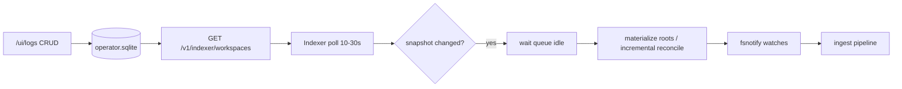

# Plan: Indexer workspaces accurate reporting

| Field | Value |
|-------|-------|
| **Doc kind** | `feature-plan` |
| **Owners / areas** | Gateway embed UI (`/ui/logs`), `chimera-indexer`, `servicelogs`, operator SQLite store |
| **Status** | `shipped` |
| **Targets** | Next gateway + indexer minor after operator-store workspaces are default |
| **Last updated** | 2026-05-19 |
| **Supersedes / superseded by** | Complements [`indexer-workspaces-sqlite-gateway-api.md`](indexer-workspaces-sqlite-gateway-api.md) (Phase 1 done; Phases 2–3 still open). UI flicker/summary fixes are in flight separately. |
| **As-built** | [`docs/features/indexer-workspaces.md`](../features/indexer-workspaces.md) (also [`indexer-health-and-operator-logs.md`](../features/indexer-health-and-operator-logs.md) for log pinning / scope status) |

## At a glance

Operators should see **one stable workspace card per row in the operator database**, with correct **USER:PROJECT[:FLAVOR]** titles and watched paths, while live logs show progress without inventing extra cards from noisy process-level indexer lines. The supervised indexer must **stop watching paths that were removed in the UI**, pick up **adds and path edits within a predictable window**, and emit logs that survive the bounded operator log buffer. Work is ordered so the UI stops lying first, then metadata is anchored to SQLite, then log volume and retention improve, then the indexer reconciles adds, modifications, and removals reliably.

| Phase | Outcome | Status |
|-------|---------|--------|
| [Phase 1 — DB-first Workspaces cards](#phase-1--db-first-workspaces-cards) | Workspaces section lists cards from operator SQLite, not orphan log buckets | `done` |
| [Phase 2 — Scope metadata from the operator store](#phase-2--scope-metadata-from-the-operator-store) | Titles, paths, and scoped logs use DB fields; logs only enrich progress | `done` |
| [Phase 3 — Operator log fidelity and volume](#phase-3--operator-log-fidelity-and-volume) | Critical indexer lifecycle lines and UI copy stay understandable under buffer pressure | `done` |
| [Phase 4 — Indexer logging and workspace lifecycle sync](#phase-4--indexer-logging-and-workspace-lifecycle-sync) | Adds, path edits, and deletes propagate to watches and indexing within documented bounds | `done` |

---

## Background

### What works today

- **Workspaces are persisted in SQLite** (`operatorstore`): `workspaces` + `workspace_paths`, exposed to the UI via `GET /api/ui/indexer/config` and to the indexer via `GET /v1/indexer/workspaces`.
- **Supervised YAML** (`indexer.supervised.yaml`) is tuning-only; UI CRUD does not rewrite `roots:` on disk.
- The indexer **materializes watch roots** from the gateway API at session start and on hot-reload (`MaterializeRootsFromGateway` in `chimera/chimera-indexer/internal/indexer/workspaces.go`).
- A **30s workspace poll** (`defaultWorkspacesPollInterval` in `chimera/chimera-indexer/main.go`) compares API snapshots and can trigger a full watch-session reload after the work queue drains.

### Operator pain (observed)

1. **Mystery workspace cards** — Titles like `USER:—` with no project/flavor, sometimes with logs and sometimes without. These often come from **log-only partitions** (`gateway.indexer.config`, `indexer.supervised.wait_roots`, recovery polls) while the UI also has **DB-backed** managed cards.
2. **Unstable cards vs log window** — `indexer.run.start` (with `root_scopes` / `ingest_project`) falls out of the ring buffer (~5000 lines total, **~1250 cap for indexer source** in `internal/servicelogs/store.go`; client `CLIENT_CACHE_MAX` 5500, initial tail 720). Cards lose scope until backfill or refresh.
3. **UI removed workspace still indexed** — Delete in `/ui/logs` updates SQLite immediately, but the indexer may keep watching old paths until poll + reload, or **never** reload when only paths change (see below).
4. **Path add does not index / path remove still indexes** — Workspace poll fingerprint uses **workspace row ids only** (`WorkspacesResponseFingerprint`), not paths. Adding or removing a path on workspace `5` leaves fingerprint `"5"` unchanged, so **no reload** is scheduled; the running session keeps the old root set.

### Root causes (code-level)

| Issue | Mechanism |
|-------|-----------|
| Duplicate / empty-scope cards | `renderSummarizedUnified` builds **IX** cards from every `byRun` log bucket **and** **WS** cards from DB when not “covered” (`summarizedFeed.js`). |
| `USER:—` titles | `collectIndexerRunMeta` defaults `projectId` to `"—"` when logs lack scope; user label comes from session token map, not logs. |
| Delete not stopping watch | Poll interval (30s) + reload waits for **queue idle up to 10 minutes**; session continues with previous `cfg.Roots` until reload completes. |
| Path edits ignored | `WorkspacesResponseFingerprint` / `WorkspacesFingerprint` count **ids only**, not `(workspace_id, path_id, path)` sets. |
| Materialize failure after edit | `RootsFromWorkspacesResponse` is **all-or-nothing**; one bad path fails entire materialize; failed reload may leave the previous session’s roots active. |

**Related docs:** [`indexer-workspaces-sqlite-gateway-api.md`](indexer-workspaces-sqlite-gateway-api.md), [`logs-ui-page-data-refreshing.md`](logs-ui-page-data-refreshing.md), [`embedui/logs/README.md`](../../chimera/chimera-gateway/internal/server/adminui/embed/embedui/logs/README.md), [`docs/indexer.md`](../indexer.md).

**Non-goals for this plan**

- Replacing the summarized feed with a SPA framework.
- Full corpus deletion / vector tombstone implementation (called out as follow-up; design hooks required).
- Changing `GET /api/ui/*` auth model.

---

## Phase 1 — DB-first Workspaces cards

**Goal.** The Workspaces section on `/ui/logs` shows **exactly one card per operator-store workspace row** (plus explicit drafts), not one card per log partition or per watched path.

**Deliverables**

- Change `renderSummarizedUnified` Workspaces assembly in `embedui/logs/app/summarizedFeed.js`:
  - **Primary list:** `ctx.lastIndexerOperatorWorkspacesNested` from `GET /api/ui/indexer/config` (already hydrated).
  - **Attach live state** from `byRun` / partition registry by `workspace_id`, then `(project_id, flavor_id)`, then path set — do **not** create a new card when no DB row matches.
  - **Orphan indexer lines** (no DB row): remain under **Services → chimera-indexer** only; optional single “process status” strip, not a Workspace card.
- Remove or narrow duplicate paths: drop separate “WS when uncovered” vs “IX when covered” dual cards; one card component with DB id `data-workspace-managed-id` / stable `ix-opws-{hash}`.
- **Draft workspaces** (`workspaceDrafts`) unchanged in UX; still not in DB until saved.
- **Stale snapshot cards** (`INDEXER_WATCH_ROOTS_LS`): only when DB row is gone and operator explicitly wants history; otherwise prefer DB row + paths.
- Goja tests: render with nested `workspaces` in ctx → expect N cards, titles `USER:PROJECT:FLAVOR`, no duplicate titles for multi-path workspace.
- Update `embedui/logs/README.md` Workspaces section: **SQLite is the card list**; logs are telemetry.

**Acceptance**

- With two paths on one workspace, the Workspaces section shows **one** card, not two.
- With indexer spam in logs but **no** DB workspaces, Workspaces section is empty (or drafts only); chimera-indexer service card still shows aggregate progress.
- Deleting a workspace in the UI removes its card on next config hydrate (already partially true); card list does not respawn from old log buckets.

**Status:** `done`

---

## Phase 2 — Scope metadata from the operator store

**Goal.** Card titles and watched paths are **always** taken from the operator database; logs supply progress, state, and scoped event log rows—not identity.

**Deliverables**

- **`mergeOperatorStoreIntoIndexerMeta(meta, wsRow)`** (or extend `mergeOperatorStorePathsIntoIndexerMeta`):
  - Set `projectId`, `flavorId`, `workspaceId`, `watchRootPaths` from nested workspace row **before** rendering title or summary KV.
  - Apply to both DB-driven cards and any log-enriched card tied to a workspace id.
- **`collectIndexerRunMeta` / card render:** When `workspace_id` is known (DB or log), never show `"—"` for project if DB has `project_id`; same for flavor.
- **Scoped full log** (`filterEventsForIndexerScopeFullLog`): For `opws\x1e…` buckets, allow matching when project is known from DB even if log lines omit `ingest_project` (pass scope coords from store, not only from `opws` segments).
- **Session scope registry** in `ctx` (memory only, keyed by `workspace_id`): last known `{ project_id, flavor_id, paths[] }` updated on each successful `/api/ui/indexer/config` fetch—survives `indexer.run.start` scrolling out of the buffer.
- Enforce **non-empty `project_id`** on create/update in API (`handlers.go`) and UI save; reject or migrate legacy empty rows that produce `USER:—` and broken `opws` matching.
- **Indexer service card** “Managed workspaces” list: already one link per workspace; ensure labels use same `operatorManagedWorkspaceTitleText` (done in recent UI work).

**Acceptance**

- Restart indexer, scroll logs so `indexer.run.start` is not in the client buffer: workspace cards still show correct **USER:PROJECT:FLAVOR** and watched paths from DB.
- Expanding scoped log shows lines when jobs exist for that scope, without requiring `indexer.run.start` in-window.
- No workspace row in DB with blank `project_id` after migration guard.

**Status:** `done`

---

## Phase 3 — Operator log fidelity and volume

**Goal.** Operators can trust `/ui/logs` and card subtitles under heavy indexer traffic: fewer misleading lines, preserved lifecycle context, and clearer copy when the system is waiting or misconfigured.

**Deliverables**

### A. Gateway log buffer (`servicelogs`)

- **Pin per-scope lifecycle records** in the ring (or side index keyed by `index_run_id` + `workspace_id`):
  - Always retain latest `indexer.run.start` per run (with `root_scopes` JSON).
  - Retain latest `indexer.run.done` / terminal error per run.
  - Optional: latest `indexer.scope.status` per `indexer_target_key`.
- Pinning runs **before** `trimSourceToMax` for `chimera-indexer` so per-file debug lines cannot evict `indexer.run.start`.
- Config hook: `operator_logs.indexer_pinned_lines_max` (default small, e.g. 64) — document in `gateway.example.yaml`.
- **Reduce default indexer log noise** (product + code):
  - Document recommended `log_level: info` for supervised deployments.
  - Demote per-file trace to debug where still at info today.
  - Rate-limit or sample repetitive lines (`indexer.scope.active_file`, queue snapshots) — e.g. one active-file line per scope per N seconds.

### B. Client log window

- **`indexerScopeRegistry` in ctx** (Phase 2) reduces dependence on tail/backfill for identity.
- Optional: on card expand, if scoped log empty but DB has paths, show CTA “Scroll up for older indexer lines” linking to filter hint (copy only).

### C. Messaging refinements (UI + operator copy)

| Situation | Current / problem | Target copy / behavior |
|-----------|-------------------|-------------------------|
| Managed workspace, no logs in buffer | “Saved · waiting for indexer logs…” | “Configured in gateway · no recent indexer lines in this window — scroll up or wait for activity” |
| Supervised wait, no roots | Generic indexer spam | Service card: “Waiting for workspace paths — add paths in Workspaces” |
| `USER:—` title | Confusing | Prevent via Phase 2; if legacy row, badge “Incomplete — set project in Configure” |
| Delete workspace | Silent | Toast: “Removed from configuration. Indexer will stop this scope within {poll interval} (or after current jobs finish).” |
| Path add | No feedback | “Path saved. Indexer picks up new directories within {poll interval}.” |
| Materialize / path error | Opaque | Surface gateway/indexer log line: “Path not visible to indexer process: …” |

- Wire copy through `operator_copy.js` / `operatorMessageIndexer.js` where messages are log-derived; keep UI strings in `summarizedFeed.js` / workspace draft cards consistent.

### D. Logging frequency guidelines (document in `docs/indexer.md`)

| Event | Suggested level | Cadence |
|-------|-----------------|--------|
| `indexer.run.start` / `indexer.run.done` | info | once per session per run |
| `gateway.indexer.config` | info | once per indexer session (already) |
| `indexer.supervised.wait_roots` | info | on state entry + every 15s while waiting (not every loop tick at debug) |
| `indexer.supervised.workspaces_poll` | debug | no change on unchanged fingerprint |
| `indexer.supervised.workspaces_changed` | info | include `prev_workspaces`, `new_workspaces`, **`prev_paths_hash`, `new_paths_hash`** |
| `indexer.scope.status` | info | on change or every 30–60s per scope |
| `indexer.scope.active_file` | debug | sampled |
| `indexer.job.ingested` / failed | info | per job (or aggregate every N files at info) |
| Recovery poll | warn | unchanged |

**Acceptance**

- Under sustained indexing, `indexer.run.start` for the active run remains queryable in `/api/ui/logs` backfill while per-file lines rotate.
- Operators do not see `USER:—` on newly created workspaces.
- Delete/add path toasts set expectations on delay (poll + queue drain).

**Status:** `done`

---

## Phase 4 — Indexer logging and workspace lifecycle sync

**Goal.** When an operator **adds**, **modifies**, or **removes** a workspace or path in the UI, the supervised indexer **reconciles** its watch set and indexing behavior within a documented upper bound, and structured logs make diagnosis obvious.

**Deliverables**

### A. Path-aware workspace snapshot (fixes add/remove path ignored)

- Replace id-only fingerprint with a stable **roots snapshot hash**, e.g. sorted tuples:
  - `(workspace_id, path_id, normalized_abs_path, project_id, flavor_id)`
- Implement `WorkspacesRootsFingerprint(resp)` and use it in:
  - `chimera-indexer/main.go` workspace poll
  - Outer-loop baseline after `materializeSupervisedRoots`
- Log on change: `indexer.supervised.workspaces_changed` with both id list and `paths_hash` (short hex).
- **Acceptance:** Add path to existing workspace → fingerprint changes → reload scheduled within one poll interval (default 30s) after queue idle.

### B. Reload and queue policy (fixes delete still indexing)

| Strategy | Purpose |
|----------|---------|
| **Shorter poll default** | e.g. 10s configurable via `workspaces_poll_interval_ms` in supervised YAML (default documented). |
| **Reload on shrink** | When new snapshot ⊂ old (workspace or path removed), allow reload with **shorter idle wait** (e.g. 30s cap) or cancel ingest for removed scopes only (preferred long-term). |
| **Reload on grow** | When paths added, reload after idle (keep fairness) or incremental add (Phase C). |
| **Do not advance fingerprint optimistically** until `materializeSupervisedRoots` + new session **succeed** — on failure, revert fingerprint and log `indexer.supervised.workspaces_apply_failed`. |
| **UI delete acknowledgement** | After `DELETE /api/ui/indexer/workspaces/{id}`, optional `POST /api/ui/indexer/reconcile` that logs `gateway.operator.workspace.deleted` (already) and returns `{ indexer_poll_seconds, note }`. |

### C. Incremental root reconciliation (aligns with [`indexer-workspaces-sqlite-gateway-api.md`](indexer-workspaces-sqlite-gateway-api.md) Phase 3)

- Refactor `RunWatchers` / supervised session to support **`AddRoot` / `RemoveRoot`** without full process session tear-down when only the path set changes.
- On **remove path**: stop fsnotify watches for that root; stop enqueueing new work; optional tombstone job for corpus (see D).
- On **add path**: add watches + targeted initial scan for new root only.
- YAML tuning hot-reload remains file-watcher based; **workspace CRUD never touches YAML**.

### D. Partial materialize (fixes one bad path blocking all roots)

- Change `RootsFromWorkspacesResponse` to **best-effort** per path:
  - Valid paths → included.
  - Invalid paths → log `indexer.workspace.path_skipped` with `workspace_id`, `path`, `err`; surface in UI path list as warning if API returns path status.
- Never leave previous session roots active when API response is strictly smaller (deleted workspace) — **apply removal even if remaining paths fail stat**.

### E. Indexer structured logging for scope (Phase 4 of original ordering)

- On **every** `indexer.scope.status`, `indexer.job.*`, and periodic heartbeat (e.g. 60s): include `workspace_id`, `ingest_project`, `flavor_id`, `indexer_target_key`, `index_run_id`.
- Ensures `indexerBucketsFromCache` / `indexerSyntheticRunTargetsFromJobs` work after `indexer.run.start` ages out.
- `indexer.run.start` remains authoritative for `root_scopes` JSON but is no longer the only carrier.

### F. Corpus / vector cleanup (explicit follow-up, design now)

| Operation | Indexer | Gateway / vectorstore |
|-----------|---------|------------------------|
| Delete workspace | Stop watches; stop new ingest | Enqueue **scope purge** job (project+flavor+workspace) — document as future PR |
| Delete single path | Remove root | Purge vectors for files only under that root |
| Change path | Remove old root, add new | Treat as delete + add |
| Change project/flavor | Reload scope | Purge old collection name; re-ingest |

Document operator expectation: **“Delete workspace stops new indexing immediately after reload; existing vectors may remain until purge job ships.”**

### G. Tenant consistency

- Audit `operatorIndexerTenantID()` (`""` for UI) vs `GET /v1/indexer/workspaces` Bearer `sess.TenantID` + fallback to `""`.
- Decision: **single canonical tenant** for desktop single-user (document); or UI writes same tenant as gateway token.
- Test: create/delete via UI visible on indexer poll within one interval.

**Acceptance**

- **Remove workspace in UI:** Within `workspaces_poll_interval_ms` + idle bound, indexer logs `workspaces_changed` with removed id/path; filesystem events stop for deleted paths; no new ingest for that scope.
- **Add path:** New directory indexed without requiring YAML edit or full gateway restart.
- **Remove path only:** Fingerprint changes; indexer drops that root without deleting other workspaces’ paths.
- **One bad path on disk:** Other paths continue to index; warning visible in logs/UI.
- Logs for a workspace remain attachable to the correct card via `workspace_id` without `indexer.run.start` in the client tail.

**Status:** `done`

---

## Cross-cutting strategies (add / modify / remove)

Summary for implementers and operators:

| Operator action | DB | UI (this plan) | Indexer (Phase 4) |
|-----------------|----|----------------|-------------------|
| **Add workspace** | INSERT workspace + paths | Card appears from config hydrate | Poll detects new ids/paths → add watches |
| **Add path** | INSERT path row | Paths list in Configure | **Path hash** change → reload or AddRoot |
| **Edit project/flavor** | UPDATE workspace | Title updates from DB | Fingerprint changes → reload; consider corpus purge |
| **Remove path** | DELETE path row | Path removed in UI | **Path hash** change → RemoveRoot |
| **Remove workspace** | DELETE CASCADE | Card gone | Id removed from snapshot → reload → stop watches |

---

## Open questions

1. **Corpus purge v1** — Stop watch only, or block release on basic collection delete API?
2. **Poll interval default** — 10s vs 30s for desktop battery/CPU?
3. **Incremental watches vs reload** — Ship path-hash + full reload first, incremental in same release or follow-up PR?
4. **Legacy empty `project_id` rows** — One-shot SQL migration vs hard delete?

---

## References

- Code:
  - `chimera/chimera-gateway/internal/server/adminui/embed/embedui/logs/app/summarizedFeed.js` — Workspaces timeline, meta merge, service summary
  - `chimera/chimera-gateway/internal/server/adminui/api/indexer/handlers.go` — UI CRUD, `workspacesAPIPayload`
  - `chimera/chimera-gateway/internal/operatorstore/store.go` — `DeleteWorkspace`, `AddPath`
  - `chimera/chimera-gateway/internal/server/indexerapi/indexer.go` — `GET /v1/indexer/workspaces`
  - `chimera/chimera-indexer/main.go` — workspace poll, hot reload
  - `chimera/chimera-indexer/internal/indexer/workspaces.go` — fingerprints, `RootsFromWorkspacesResponse`
  - `chimera/internal/servicelogs/store.go` — ring buffer, indexer line cap
- Plans: [`indexer-workspaces-sqlite-gateway-api.md`](indexer-workspaces-sqlite-gateway-api.md), [`logs-ui-page-data-refreshing.md`](logs-ui-page-data-refreshing.md)
- Docs: [`docs/indexer.md`](../indexer.md), [`docs/configuration.md`](../configuration.md)
